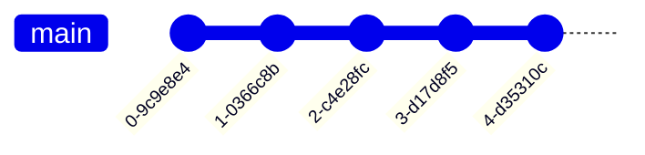
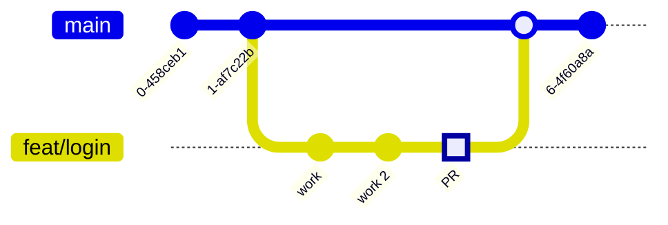
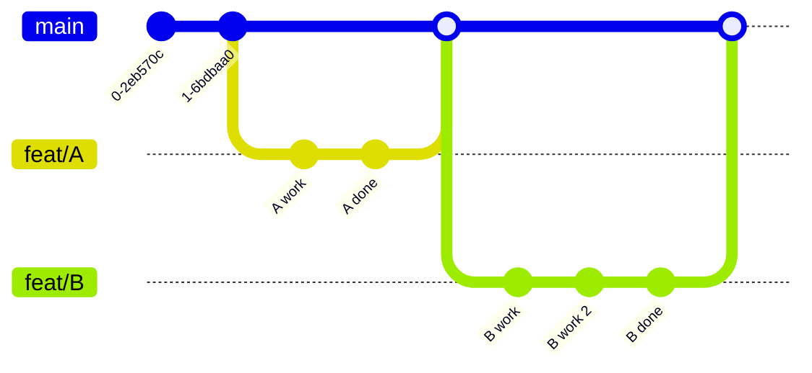
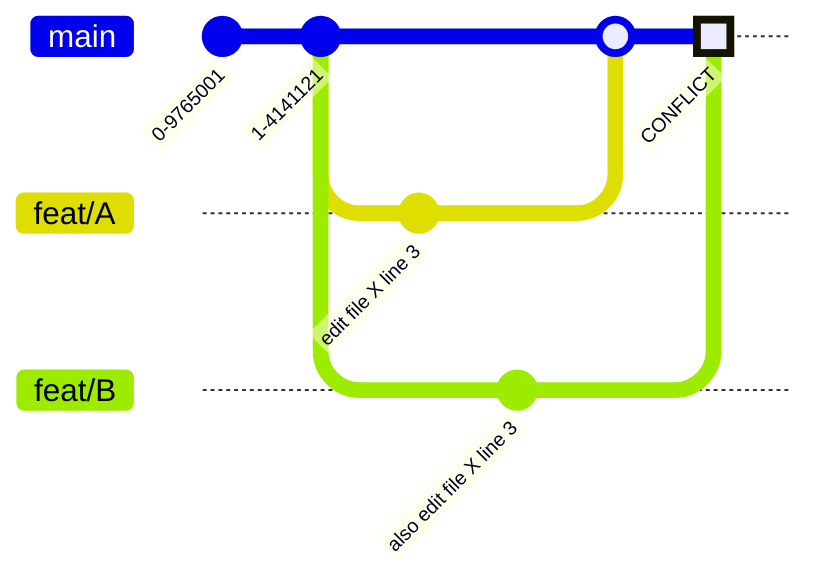
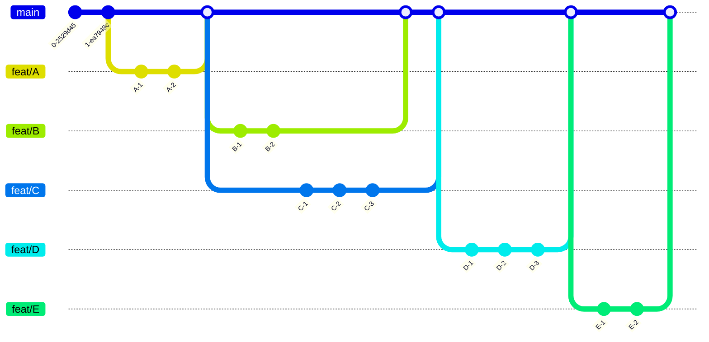

# Claude Starter Workshop

<div class="text-gray-400 mt-4">fearnot.ai</div>

---
layout: center
---

# Lesson 0

엔지니어가 된다는 것

---
layout: center
---

# Rule 1 — 외우지 마라. 이해해라.

<div class="grid grid-cols-2 gap-6 mt-8">
<div class="bg-red-950/40 border border-red-500/30 rounded-xl p-6 text-left">
<div class="text-red-400 font-bold text-sm mb-4 tracking-widest">NOT THIS</div>

```
"forEach is Array.prototype..."
"useEffect runs after render..."
"TCP is a 3-way handshake..."

Memorize everything
```

</div>
<div class="bg-green-950/40 border border-green-500/30 rounded-xl p-6 text-left">
<div class="text-green-400 font-bold text-sm mb-4 tracking-widest">THIS</div>

```
"When do I use this?"
"Why does this exist?"
"Is this the same as that?"
"Do we need this or not?"
```

</div>
</div>

<v-clicks>

좋은 엔지니어는 문법을 외우지 않는다.

**언제**, **왜** 쓰는지를 안다.

</v-clicks>

---
layout: center
---

# Rule 2 — 바보같이 해라.

<div class="grid grid-cols-2 gap-6 mt-8">
<div class="bg-zinc-800/60 border border-zinc-600/40 rounded-xl p-6 text-left">
<div class="text-blue-400 font-bold text-sm mb-4 tracking-widest">DEBUGGING</div>

```
Something broke?

1. Add logs everywhere
2. Find where it leaks
3. Fix it

No magic. Just narrow it down.
```

</div>
<div class="bg-zinc-800/60 border border-zinc-600/40 rounded-xl p-6 text-left">
<div class="text-purple-400 font-bold text-sm mb-4 tracking-widest">ASKING</div>

```
Don't know something?

Before: StackOverflow
Now: ChatGPT, Claude, etc.

The only stupid thing
is not asking.
```

</div>
</div>

<v-click>

엔지니어들 전부 물어보면서 한다. 바보같은 질문은 없다.

</v-click>

---
layout: center
---

# Rule 3 — 틀리는 걸 두려워하지 마라.

<div class="bg-zinc-800/60 border border-zinc-600/40 rounded-xl p-6 mt-8 inline-block text-left">

```
Local environment
  = your playground
  = not production
  = nobody sees your mistakes

Break things. Fix things. Repeat.
Ship only when it works.
```

</div>

<v-clicks>

어차피 로컬은 테스트일 뿐이다.

마음껏 틀리고, 출시 때만 맞추면 되는 게임이다.

</v-clicks>

---
layout: center
---

<div class="grid grid-cols-3 gap-4 mt-4 text-sm">
<div class="bg-zinc-800/60 border border-zinc-600/40 rounded-xl p-4">
<div class="text-blue-400 font-bold mb-1">Rule 1</div>
외우지 마라. 이해해라.
</div>
<div class="bg-zinc-800/60 border border-zinc-600/40 rounded-xl p-4">
<div class="text-purple-400 font-bold mb-1">Rule 2</div>
바보같이 해라. 물어봐라.
</div>
<div class="bg-zinc-800/60 border border-zinc-600/40 rounded-xl p-4">
<div class="text-green-400 font-bold mb-1">Rule 3</div>
틀리는 걸 두려워하지 마라.
</div>
</div>

<v-clicks>

StackOverflow에서 ChatGPT/Claude로 넘어왔을 뿐이다. 본질은 같다.

이 세 가지만 지키면, **잘하는 엔지니어가 될 수 있다.**

</v-clicks>

---
layout: center
---

# /0-local-setup 준비합니다

아래 단계를 하나씩 같이 따라갑니다

---
layout: center
---

# Step 1 — GitHub 회원가입

<div class="grid grid-cols-[auto_1fr] gap-6 mt-8 text-left items-start">

<div class="bg-zinc-800/60 border border-zinc-600/40 rounded-xl p-5 text-sm w-80">

**1)** 브라우저에서 **github.com** 접속

**2)** 오른쪽 위 **Sign up** 클릭

**3)** 이메일, 비밀번호, 유저네임 입력

**4)** 이메일 인증 코드 확인

**5)** 무료 플랜(Free) 선택

</div>

<div class="bg-sky-950/40 border border-sky-500/30 rounded-xl p-5 text-sm">

**Personal Access Token 만들기** (나중에 MCP 연결에 필요)

**1)** 로그인 후 오른쪽 위 **프로필 아이콘** → **Settings**

**2)** 왼쪽 맨 아래 **Developer settings** 클릭

**3)** **Personal access tokens** → **Tokens (classic)** → **Generate new token (classic)**

**4)** Note: `claude-starter` 입력

**5)** Expiration: **90 days** 선택

**6)** 체크: `repo` (전체), `read:org`, `workflow`

**7)** **Generate token** → 나오는 `ghp_xxxxx` 를 **어딘가에 복사해두세요!** (다시 못 봄)

</div>

</div>

<v-click>

이 토큰은 나중에 CLI 로그인과 MCP 연결에 씁니다. 잃어버리면 다시 만들면 돼요.

</v-click>

---
layout: center
---

# Step 1.5 — Pencil 설치

<div class="bg-zinc-800/60 border border-zinc-600/40 rounded-xl p-6 mt-8 text-left">

**1)** 브라우저에서 **pencil.li** 접속

**2)** **Download** 클릭 → 설치 파일 실행

**3)** Mac: `.dmg` → Applications에 드래그 &nbsp;/&nbsp; Windows: `.exe` → 설치 후 실행

**4)** 설치 끝나면 Pencil 앱 실행 → 회원가입 또는 로그인

</div>

<v-click>

Pencil은 나중에 프로토타입을 그릴 때 씁니다. 지금 깔아두면 나중에 안 기다려도 됩니다.

</v-click>

---
layout: center
---

# Step 2 — 터미널 열기

<div class="grid grid-cols-2 gap-6 mt-8">

<div class="bg-blue-950/40 border border-blue-500/30 rounded-xl p-6 text-left">
<div class="text-blue-400 font-bold text-sm mb-4">Mac</div>

**방법 1)** `Cmd + Space` → "터미널" 입력 → Enter

**방법 2)** Finder → 응용 프로그램 → 유틸리티 → 터미널

<div class="text-gray-500 text-sm mt-4">검은 창이 뜨면 성공!</div>

</div>

<div class="bg-green-950/40 border border-green-500/30 rounded-xl p-6 text-left">
<div class="text-green-400 font-bold text-sm mb-4">Windows</div>

**먼저 Git 설치가 필요합니다!**

**1)** 브라우저에서 `git-scm.com` 접속

**2)** **Download for Windows** 클릭 → 설치 파일 실행

**3)** 설치 중 이 옵션 꼭 선택:
`Git from the command line and also from 3rd-party software`

**4)** 나머지는 전부 Next → Install

**5)** 설치 끝나면: `Win키` → "PowerShell" 검색 → 열기
<span class="text-red-400 text-xs">(x86 붙은 건 절대 클릭 금지!)</span>

</div>

</div>

---
layout: center
---

# Step 3 — Claude Code 설치

<div class="grid grid-cols-2 gap-6 mt-8">

<div class="bg-blue-950/40 border border-blue-500/30 rounded-xl p-6 text-left">
<div class="text-blue-400 font-bold text-sm mb-4">Mac</div>

터미널에 복사-붙여넣기:

```shell
curl -fsSL https://claude.ai/install.sh | bash
# 또는
curl -fsSL https://claude.ai/install.sh | zsh
```

<div class="text-gray-400 text-sm mt-4">

끝나면 터미널을 **닫고 다시 열어주세요**

</div>

</div>

<div class="bg-green-950/40 border border-green-500/30 rounded-xl p-6 text-left">
<div class="text-green-400 font-bold text-sm mb-4">Windows</div>

PowerShell에 복사-붙여넣기:

```shell
irm https://claude.ai/install.ps1 | iex
```

<div class="text-gray-400 text-sm mt-4">

끝나면 PowerShell을 **닫고 다시 열어주세요**

</div>

</div>

</div>

<v-click>

확인: `claude --version` 입력 → 버전 번호가 나오면 성공!

</v-click>

---
layout: center
---

# Step 4 — 레포 받기 + Claude 실행

터미널/PowerShell에 한 줄씩 입력하세요:

<div class="mt-6">

```shell
git clone https://github.com/DanialDaeHyunNam/claude-starter.git
cd claude-starter
claude --dangerously-skip-permissions
```

</div>

<v-clicks>

`git clone` = GitHub에서 프로젝트를 내 컴퓨터에 복사

`cd` = 그 폴더로 이동

`--dangerously-skip-permissions` = 매번 "허용하시겠습니까?" 묻지 않게 하는 옵션

`claude` = Claude Code 실행 → 이 화면이 뜨면 준비 완료!

</v-clicks>

---
layout: center
---

# 문제가 생기면?

<div class="grid grid-cols-3 gap-3 mt-6 text-left text-xs">

<div class="bg-zinc-800/60 border border-zinc-600/40 rounded-xl p-4">

**`command not found: claude`**

터미널을 완전히 닫고 다시 열기

안 되면:
`echo 'export PATH="$HOME/.local/bin:$PATH"' >> ~/.zshrc && source ~/.zshrc`

</div>

<div class="bg-zinc-800/60 border border-zinc-600/40 rounded-xl p-4">

**Win: "스크립트 실행 불가"**

`Set-ExecutionPolicy RemoteSigned -Scope CurrentUser`

</div>

<div class="bg-zinc-800/60 border border-zinc-600/40 rounded-xl p-4">

**Win: "32-bit not supported"**

x86 PowerShell 말고 일반 PowerShell로

</div>

<div class="bg-zinc-800/60 border border-zinc-600/40 rounded-xl p-4">

**Win: "requires git-bash"**

Git 설치 안 됨. Step 2 다시!

</div>

<div class="bg-zinc-800/60 border border-zinc-600/40 rounded-xl p-4">

**Win: "not in your PATH"**

Win키 → "환경 변수" 검색 → 환경 변수 버튼 → 사용자 변수에서 `Path` 선택 → 편집 → 새로 만들기 → `%USERPROFILE%\.local\bin` 입력 → 확인 3번 → PowerShell 재시작

</div>


</div>


---
layout: center
---

# 다 끝났나요?

<v-clicks>

claude-starter 폴더에서 claude 켜고

```bash
/0-local-setup
```

을 실행합니다.

</v-clicks>

---
layout: center
---

# Lesson 1

전반적인 환경에 대한 이해

---
layout: center
---

# 1-1. 로컬 개발 환경

/0-local-setup 에서 설치하는 것들

---
layout: center
---

# 우리가 설치하는 것들

<div class="mt-6">

| Role | macOS | Windows | What it does |
|------|-------|---------|--------------|
| Package Manager | Homebrew | Scoop | Install tools |
| Version Manager | asdf | mise | Node 20 ↔ 22 |
| Runtime | Node.js + Bun | Node.js + Bun | Run code |
| Shell Theme | Oh My Zsh | Oh My Posh | Pretty terminal |
| AI Agent | Claude Code | Claude Code | Codes for you |
| Editor | VS Code / Cursor | VS Code / Cursor | View code |

</div>

---
layout: center
---

# 패키지 매니저 — Before / After

<div class="grid grid-cols-2 gap-6 mt-8">
<div class="bg-red-950/40 border border-red-500/30 rounded-xl p-6 text-left">
<div class="text-red-400 font-bold text-sm mb-4 tracking-widest">BEFORE</div>

```shell
$ install node
... how?

$ # Google "install node for mac"
$ # Download .dmg
$ # Drag to /Applications
$ # Repeat for each tool...
```

</div>
<div class="bg-green-950/40 border border-green-500/30 rounded-xl p-6 text-left">
<div class="text-green-400 font-bold text-sm mb-4 tracking-widest">AFTER</div>

```shell
$ brew install node
Done. ✓

$ brew install git
Done. ✓

$ brew install bun
Done. ✓
```

</div>
</div>

<v-click>

Homebrew / Scoop = 개발 도구의 앱스토어

</v-click>

---
layout: center
---

# 버전 매니저 — Before / After

<div class="grid grid-cols-2 gap-6 mt-8">
<div class="bg-red-950/40 border border-red-500/30 rounded-xl p-6 text-left">
<div class="text-red-400 font-bold text-sm mb-4 tracking-widest">BEFORE</div>

```shell
Project A needs Node 18
Project B needs Node 20
Project C needs Node 22

$ # uninstall 18...
$ # install 20...
$ # uninstall 20...
$ # install 22...
```

</div>
<div class="bg-green-950/40 border border-green-500/30 rounded-xl p-6 text-left">
<div class="text-green-400 font-bold text-sm mb-4 tracking-widest">AFTER</div>

```shell
$ asdf install nodejs 18.0.0
$ asdf install nodejs 20.12.0
$ asdf install nodejs 22.0.0

$ asdf local nodejs 20.12.0
# Done. Switched instantly.
```

</div>
</div>

<v-click>

asdf / mise = 버전 리모컨

</v-click>

---
layout: center
---

# 터미널 꾸미기 — Before / After

<div class="grid grid-cols-2 gap-6 mt-8">
<div class="bg-red-950/40 border border-red-500/30 rounded-xl p-6 text-left">
<div class="text-red-400 font-bold text-sm mb-4 tracking-widest">BEFORE</div>

```shell
$
$ # ... where am I?
$ # ... what branch?
$ # ... is git clean?
$ # ... what node version?
$
```

</div>
<div class="bg-green-950/40 border border-green-500/30 rounded-xl p-6 text-left">
<div class="text-green-400 font-bold text-sm mb-4 tracking-widest">AFTER</div>

```shell
~/my-app main ✓ node:20
$
# folder, branch, status,
# runtime — all at a glance
```

</div>
</div>

<v-click>

Oh My Zsh / Oh My Posh = 터미널 메이크오버

</v-click>

---
layout: center
---

# 에디터 — Before / After

<div class="grid grid-cols-2 gap-6 mt-8">
<div class="bg-red-950/40 border border-red-500/30 rounded-xl p-6 text-left">
<div class="text-red-400 font-bold text-sm mb-4 tracking-widest">BEFORE</div>

```
Notepad / TextEdit

  no syntax highlighting
  no autocomplete
  no file tree
  no terminal
  no git integration
```

</div>
<div class="bg-green-950/40 border border-green-500/30 rounded-xl p-6 text-left">
<div class="text-green-400 font-bold text-sm mb-4 tracking-widest">AFTER</div>

```
VS Code / Cursor

  ✓ syntax highlighting
  ✓ autocomplete
  ✓ file tree
  ✓ built-in terminal
  ✓ git + AI copilot
```

</div>
</div>

---
layout: center
---

# Mac vs Windows

<div class="grid grid-cols-[1fr_auto_1fr] gap-4 items-center mt-8 text-lg">
<div class="bg-zinc-800/60 border border-zinc-600/40 rounded-xl p-5">

**macOS**

Homebrew
asdf
Oh My Zsh
iTerm2

</div>
<div class="text-gray-500 text-2xl">

= &nbsp;
= &nbsp;
= &nbsp;
= &nbsp;

</div>
<div class="bg-zinc-800/60 border border-zinc-600/40 rounded-xl p-5">

**Windows**

Scoop
mise
Oh My Posh
Win Terminal

</div>
</div>

<v-click>

<code>.tool-versions</code> 파일을 공유하면 Mac ↔ Windows 동일 환경

</v-click>

---
layout: center
---

# 1-2. Git & GitHub

---
layout: center
---

# Linus Torvalds

<div class="flex gap-8 items-center mt-8">
<div class="w-1/3">

</div>
<div class="w-2/3 text-xl leading-relaxed text-left">

<v-clicks>

**Linux** 만든 사람 — 인터넷의 대부분이 Linux 위에서 돌아감

Linux가 너무 커져서 코드 관리 도구가 필요했음

기존 도구가 맘에 안 들어서 **2주 만에 Git을 만듦**

Nvidia한테 F\*\*k you 날린 전설

Bill Gates도 까는 미친 천재

</v-clicks>

</div>
</div>

---
layout: center
---

# Git이 왜 필요한가?

<div class="grid grid-cols-2 gap-6 mt-8">
<div class="bg-red-950/40 border border-red-500/30 rounded-xl p-6 text-left">
<div class="text-red-400 font-bold text-sm mb-4 tracking-widest">WITHOUT GIT</div>

```
report_final.doc
report_final2.doc
report_REAL_final.doc
report_THIS_ONE.doc

... which is latest?
```

<div class="text-red-400 mt-3 text-sm">복사 지옥</div>
</div>
<div class="bg-green-950/40 border border-green-500/30 rounded-xl p-6 text-left">
<div class="text-green-400 font-bold text-sm mb-4 tracking-widest">WITH GIT</div>

```
.git/

v1 <- v2 <- v3 <- v4

Go back to any
point in time
```

<div class="text-green-400 mt-3 text-sm">시간 여행</div>
</div>
</div>

---
layout: center
---

# GitHub

<div class="mt-8">

```
  My Computer                     Cloud
  +----------+    git push    +------------------+
  |          |  ----------->  |                  |
  |  .git/   |                |   GitHub         |
  |          |  <-----------  |   (remote repo)  |
  |          |    git pull    |                  |
  +----------+                +------------------+
```

</div>

<v-clicks>

핵심: 내 코드를 클라우드에 올리는 것

**GitHub** = 사실상 표준 &nbsp;|&nbsp; GitLab = 일부 기업 &nbsp;|&nbsp; Bitbucket = Atlassian

</v-clicks>

---
layout: center
---

# 전체 그림

<div class="grid grid-cols-[1fr_auto_1.4fr_auto_1fr] gap-3 items-start mt-6 text-xs">

<div class="bg-indigo-950/50 border border-indigo-500/30 rounded-xl p-4">
<div class="text-indigo-400 font-bold text-sm mb-3">My Computer</div>
<div class="bg-white/10 rounded-lg px-3 py-1.5 mb-2 font-mono text-green-400">main</div>
<div class="bg-white/10 rounded-lg px-3 py-1.5 mb-2 font-mono">feat/login</div>
<div class="bg-white/10 rounded-lg px-3 py-1.5 mb-2 font-mono">feat/signup</div>
<div class="bg-white/5 rounded-lg px-3 py-1.5 font-mono text-gray-500">fix/header <span class="text-[10px]">local only</span></div>
</div>

<div class="flex flex-col items-center gap-2 pt-16 text-gray-500">
<div class="text-[10px]">push</div>
<div>→</div>
<div>→</div>
<div class="text-[10px] mt-8">push</div>
<div>←</div>
</div>

<div class="bg-sky-950/50 border border-sky-500/30 rounded-xl p-4">
<div class="text-sky-400 font-bold text-sm mb-3">GitHub Cloud</div>
<div class="bg-white/10 rounded-lg px-3 py-1.5 mb-2 font-mono text-green-400">main</div>
<div class="flex flex-col gap-1.5 mb-3">
<div class="bg-white/10 rounded-lg px-3 py-1.5 font-mono">feat/login</div>
<div class="bg-white/10 rounded-lg px-3 py-1.5 font-mono">feat/signup</div>
<div class="bg-white/10 rounded-lg px-3 py-1.5 font-mono">fix/typo <span class="text-gray-500 text-[10px]">from Tom</span></div>
</div>
<div class="text-center text-gray-500 text-[10px] mb-1">↓ PR</div>
<div class="bg-purple-500/20 border border-purple-500/40 rounded-lg px-3 py-1.5 mb-2 font-mono text-purple-300 text-center">Pull Request</div>
<div class="text-center text-gray-500 text-[10px] mb-1">↓ review + approve</div>
<div class="bg-green-500/20 border border-green-500/40 rounded-lg px-3 py-1.5 font-mono text-green-300 text-center">main updated ✓</div>
</div>

<div class="flex flex-col items-center gap-2 pt-16 text-gray-500">
<div class="text-[10px]">push</div>
<div>←</div>
</div>

<div class="bg-indigo-950/50 border border-indigo-500/30 rounded-xl p-4">
<div class="text-indigo-400 font-bold text-sm mb-3">Tom's Computer</div>
<div class="bg-white/10 rounded-lg px-3 py-1.5 mb-2 font-mono text-green-400">main</div>
<div class="bg-white/10 rounded-lg px-3 py-1.5 mb-2 font-mono">fix/typo</div>
<div class="bg-white/5 rounded-lg px-3 py-1.5 mb-2 font-mono text-gray-500">feat/search <span class="text-[10px]">local</span></div>
<div class="bg-white/5 rounded-lg px-3 py-1.5 mb-2 font-mono text-gray-500">feat/filter <span class="text-[10px]">local</span></div>
<div class="bg-white/5 rounded-lg px-3 py-1.5 font-mono text-gray-500">feat/sort <span class="text-[10px]">local</span></div>
</div>

</div>

<v-click>

<div class="text-gray-500 text-xs mt-4">local branch → push → PR → review → merge to main</div>

</v-click>

---
layout: center
---

# 1 Thread

<div class="mt-4">



</div>

<v-click>

가장 단순한 형태 — 혼자, 한 줄

</v-click>

---
layout: center
---

# Branch + PR + Merge

<div class="mt-4">



</div>

<v-clicks>

<div class="grid grid-cols-4 gap-3 mt-6 text-sm">
<div class="bg-zinc-800/60 rounded-lg p-3"><strong>1.</strong> 가지 따기</div>
<div class="bg-zinc-800/60 rounded-lg p-3"><strong>2.</strong> 작업</div>
<div class="bg-zinc-800/60 rounded-lg p-3"><strong>3.</strong> PR 요청</div>
<div class="bg-zinc-800/60 rounded-lg p-3"><strong>4.</strong> Merge</div>
</div>

</v-clicks>

---
layout: center
---

# 2 Threads — 동시 작업

<div class="mt-4">



</div>

<v-clicks>

각 브랜치는 독립적으로 작업

안 겹치면 문제 없음

</v-clicks>

---
layout: center
---

# 2 Threads — Conflict

<div class="mt-4">



</div>

<v-clicks>

같은 파일, 같은 줄 = <span class="text-red-400 font-bold">Conflict!</span>

Git: "둘 중 뭘 쓸지 너가 골라" → 수동 해결 후 merge

</v-clicks>

---
layout: center
---

# N Threads — 실무

<div class="mt-4 scale-90 origin-top">



</div>

<v-click>

AI가 다 알아서 해주지만, 이 그림이 머릿속에 있으면 훨씬 수월하다

</v-click>

---
layout: center
---

# 전체 그림 — 다시 보기

<div class="grid grid-cols-[1fr_auto_1.4fr_auto_1fr] gap-3 items-start mt-6 text-xs">

<div class="bg-indigo-950/50 border border-indigo-500/30 rounded-xl p-4">
<div class="text-indigo-400 font-bold text-sm mb-3">My Computer</div>
<div class="bg-white/10 rounded-lg px-3 py-1.5 mb-2 font-mono text-green-400">main</div>
<div class="bg-white/10 rounded-lg px-3 py-1.5 mb-2 font-mono">feat/login</div>
<div class="bg-white/10 rounded-lg px-3 py-1.5 mb-2 font-mono">feat/signup</div>
<div class="bg-white/5 rounded-lg px-3 py-1.5 font-mono text-gray-500">fix/header <span class="text-[10px]">local only</span></div>
</div>

<div class="flex flex-col items-center gap-2 pt-16 text-gray-500">
<div class="text-[10px]">push</div>
<div>→</div>
<div>→</div>
<div class="text-[10px] mt-8">push</div>
<div>←</div>
</div>

<div class="bg-sky-950/50 border border-sky-500/30 rounded-xl p-4">
<div class="text-sky-400 font-bold text-sm mb-3">GitHub Cloud</div>
<div class="bg-white/10 rounded-lg px-3 py-1.5 mb-2 font-mono text-green-400">main</div>
<div class="flex flex-col gap-1.5 mb-3">
<div class="bg-white/10 rounded-lg px-3 py-1.5 font-mono">feat/login</div>
<div class="bg-white/10 rounded-lg px-3 py-1.5 font-mono">feat/signup</div>
<div class="bg-white/10 rounded-lg px-3 py-1.5 font-mono">fix/typo <span class="text-gray-500 text-[10px]">from Tom</span></div>
</div>
<div class="text-center text-gray-500 text-[10px] mb-1">↓ PR</div>
<div class="bg-purple-500/20 border border-purple-500/40 rounded-lg px-3 py-1.5 mb-2 font-mono text-purple-300 text-center">Pull Request</div>
<div class="text-center text-gray-500 text-[10px] mb-1">↓ review + approve</div>
<div class="bg-green-500/20 border border-green-500/40 rounded-lg px-3 py-1.5 font-mono text-green-300 text-center">main updated ✓</div>
</div>

<div class="flex flex-col items-center gap-2 pt-16 text-gray-500">
<div class="text-[10px]">push</div>
<div>←</div>
</div>

<div class="bg-indigo-950/50 border border-indigo-500/30 rounded-xl p-4">
<div class="text-indigo-400 font-bold text-sm mb-3">Tom's Computer</div>
<div class="bg-white/10 rounded-lg px-3 py-1.5 mb-2 font-mono text-green-400">main</div>
<div class="bg-white/10 rounded-lg px-3 py-1.5 mb-2 font-mono">fix/typo</div>
<div class="bg-white/5 rounded-lg px-3 py-1.5 mb-2 font-mono text-gray-500">feat/search <span class="text-[10px]">local</span></div>
<div class="bg-white/5 rounded-lg px-3 py-1.5 mb-2 font-mono text-gray-500">feat/filter <span class="text-[10px]">local</span></div>
<div class="bg-white/5 rounded-lg px-3 py-1.5 font-mono text-gray-500">feat/sort <span class="text-[10px]">local</span></div>
</div>

</div>

<v-click>

<div class="text-gray-500 text-xs mt-4">이제 이 그림이 이해됩니다.</div>

</v-click>

---
layout: center
---

# Git — 이것만 기억하자

<div class="grid grid-cols-2 gap-5 mt-8 text-left">

<v-clicks>

<div class="bg-zinc-800/60 border border-zinc-600/40 rounded-xl p-5">
<div class="text-blue-400 font-bold mb-2">1. 나는 어디에 있나?</div>
<div class="text-gray-300">프로젝트 폴더가 시작점</div>
<div class="font-mono text-sm text-gray-500 mt-2">~/projects/my-app/</div>
</div>

<div class="bg-zinc-800/60 border border-zinc-600/40 rounded-xl p-5">
<div class="text-green-400 font-bold mb-2">2. 배포된 main은 어디?</div>
<div class="text-gray-300">GitHub repo → <code>main</code> branch</div>
<div class="font-mono text-sm text-gray-500 mt-2">github.com/me/my-app → main</div>
</div>

<div class="bg-zinc-800/60 border border-zinc-600/40 rounded-xl p-5">
<div class="text-purple-400 font-bold mb-2">3. 지금 어떤 브랜치에 있나?</div>
<div class="text-gray-300">local branch = 내 작업 공간</div>
<div class="font-mono text-sm text-gray-500 mt-2">$ git branch → feat/login *</div>
</div>

<div class="bg-zinc-800/60 border border-zinc-600/40 rounded-xl p-5">
<div class="text-yellow-400 font-bold mb-2">4. 이것도 Git에 올라가나?</div>
<div class="text-gray-300"><code>.gitignore</code> = 제외 목록</div>
<div class="font-mono text-sm text-gray-500 mt-2">.env, node_modules/ → ignored</div>
</div>

</v-clicks>

</div>

---
layout: center
---

# 1-3. 서버

---
layout: center
---

# 서버 = 멀리 있는 컴퓨터

<div class="grid grid-cols-[1fr_auto_1fr] gap-4 items-center mt-8">
<div class="bg-zinc-800/60 border border-zinc-600/40 rounded-xl p-6">

**내 맥북**

화면 있음
마우스 클릭
전부 보임

</div>
<div class="text-4xl text-gray-500">→</div>
<div class="bg-blue-950/40 border border-blue-500/30 rounded-xl p-6">

**Server**

화면 없음
프로그램만 돌아감
포트 `:3000` 열림
외부 접근 가능

</div>
</div>

<v-click>

UI가 안 보일 뿐 — 프로그램이 켜져있고 문이 열려있다

</v-click>

---
layout: center
---

# 포트란?

<div class="bg-zinc-800/60 border border-zinc-600/40 rounded-xl p-6 mt-8 text-left inline-block">

```
  Server (= building)

    :80    -> Website (HTTP)        <- front door
    :443   -> Website (HTTPS)       <- secure door
    :3000  -> Dev server            <- dev entrance
    :5432  -> Database              <- warehouse
```

</div>

<v-click>

포트 = 건물의 출입구 번호. 각 프로그램이 자기 문을 열고 대기한다.

</v-click>

---
layout: center
---

# 1-4. 세션

---
layout: center
---

# 세션 = 연결 상태

<div class="grid grid-cols-2 gap-6 mt-8">
<div class="bg-zinc-800/60 border border-zinc-600/40 rounded-xl p-5">
<div class="text-blue-400 font-bold text-sm mb-3 tracking-widest">TERMINAL</div>

```
Tab 1 → Session A (workspace 1)
Tab 2 → Session B (workspace 2)
```

각 탭 = 독립 세션

</div>
<div class="bg-zinc-800/60 border border-zinc-600/40 rounded-xl p-5">
<div class="text-purple-400 font-bold text-sm mb-3 tracking-widest">BROWSER</div>

```
Tab 1 → Session X (logged in)
Tab 2 → Session Y (diff account)
```

각 탭 = 독립 세션

</div>
</div>

<v-click>

웹 서비스의 모든 변화는 독립적인 세션에서 발생한다

</v-click>

---
layout: center
---

# 1-5. 환경 변수

---
layout: center
---

# 환경 변수 = 코드의 매개변수

<div class="bg-zinc-800/60 border border-zinc-600/40 rounded-xl p-6 mt-8 inline-block">

```js
// Same code (= same math function)
f(x) = 2x + 1

x = 3   →  f(3) = 7      // dev
x = 10  →  f(10) = 21    // prod
```

</div>

<v-click>

같은 코드 + 다른 매개변수 = 다른 결과

</v-click>

---
layout: center
---

# 용도 1 — 환경 구분

<div class="grid grid-cols-3 gap-4 mt-8">
<div class="bg-zinc-800/60 border border-zinc-600/40 rounded-xl p-5">

**Local**

```bash
DB=local
API=test
DEBUG=true
```

<div class="text-gray-500 text-sm mt-2">내 컴퓨터</div>
</div>
<div class="bg-yellow-950/40 border border-yellow-500/30 rounded-xl p-5">

**Staging**

```bash
DB=staging
API=test
DEBUG=true
```

<div class="text-gray-500 text-sm mt-2">테스트 서버</div>
</div>
<div class="bg-green-950/40 border border-green-500/30 rounded-xl p-5">

**Production**

```bash
DB=real
API=live
DEBUG=false
```

<div class="text-gray-500 text-sm mt-2">실제 서비스</div>
</div>
</div>

---
layout: center
---

# 용도 2 — Secret 숨기기

<div class="grid grid-cols-2 gap-6 mt-8">
<div class="bg-red-950/40 border border-red-500/30 rounded-xl p-6 text-left">
<div class="text-red-400 font-bold text-sm mb-4 tracking-widest">BAD</div>

```js
const API_KEY = "sk-abc123..."
// pushed to Git
// world can see
// billing bomb
```

</div>
<div class="bg-green-950/40 border border-green-500/30 rounded-xl p-6 text-left">
<div class="text-green-400 font-bold text-sm mb-4 tracking-widest">GOOD</div>

```bash
# .env (not in Git)
API_KEY=sk-abc123...
```

```js
// In code:
const key = process.env.API_KEY
// value hidden ✓
```

</div>
</div>

<v-click>

<code>.env</code>는 <code>.gitignore</code>로 제외 — Vercel의 "Environment Variables"가 바로 이것

</v-click>

---
layout: center
---

# Lesson 2

AI 관련 용어

---
layout: center
---

# 2-1. 에이전트

---
layout: center
---

# 에이전트 vs 챗봇

<div class="grid grid-cols-2 gap-6 mt-8">
<div class="bg-zinc-800/60 border border-zinc-600/40 rounded-xl p-6 text-left">
<div class="text-gray-400 font-bold text-sm mb-4 tracking-widest">CHATBOT</div>

```
Q -> A

"Seoul weather?"
"Sunny, 15C"

One-shot conversation
```

</div>
<div class="bg-blue-950/40 border border-blue-500/30 rounded-xl p-6 text-left">
<div class="text-blue-400 font-bold text-sm mb-4 tracking-widest">AGENT</div>

```
Goal -> Execute

"Deploy this"

  1. Check code
  2. Run tests
  3. Build
  4. Deploy
  5. Report back
```

</div>
</div>

<v-clicks>

챗봇: 물으면 답한다

에이전트: 목표를 주면 **스스로 판단**하고 **행동**한다

</v-clicks>

---
layout: center
---

# Claude Code = 에이전트

<div class="bg-zinc-800/60 border border-zinc-600/40 rounded-xl p-6 mt-8 inline-block text-left">

```
You: "Build login feature"

Claude Code:
  1. Decide which files are needed
  2. Create / modify files
  3. Run tests to verify
  4. Fix errors automatically
  5. Report completion

Can read, write, and execute tools
```

</div>

---
layout: center
---

# Claude Code 핵심 개념 6가지

<div class="bg-zinc-800/60 border border-zinc-600/40 rounded-xl p-6 mt-6 text-left inline-block">

```
0. 기본 사용법    "Claude야, 이거 해줘"
1. MCP           "Claude야, 웹도 보고 슬랙도 써"
2. Skill         "나만의 명령어 만들기"
3. Subagent      "여러 명이 동시에 일하기"
4. Tools         "Claude가 쓸 수 있는 도구들"
5. Teams         "팀으로 일하기"
```

</div>

<v-click>

이것만 알면 됩니다. 하나씩 봅시다.

</v-click>

---
layout: center
---

# 0. 기본 사용법

<div class="bg-zinc-800/60 border border-zinc-600/40 rounded-xl p-6 mt-6 text-left inline-block">

```
터미널에서 claude 입력
       ↓
대화하듯이 요청
  "로그인 페이지 만들어줘"
       ↓
Claude가 코드를 짜고 파일을 만듦
       ↓
결과 확인!
```

</div>

<v-click>

카카오톡처럼 대화하면 된다. "이거 해줘"하면 알아서 해준다.

</v-click>

---
layout: center
---

# 1. MCP

<div class="grid grid-cols-2 gap-6 mt-8">
<div class="bg-zinc-800/60 border border-zinc-600/40 rounded-xl p-6 text-left">
<div class="text-gray-400 font-bold text-sm mb-4">MCP 없는 Claude</div>

```
🧠 두뇌만

코드만 짤 수 있음
```

</div>
<div class="bg-blue-950/40 border border-blue-500/30 rounded-xl p-6 text-left">
<div class="text-blue-400 font-bold text-sm mb-4">MCP 있는 Claude</div>

```
🧠 두뇌
+ 👀 웹을 볼 수 있음
+ 🖐️ 디자인 가능
+ 📢 슬랙 전송
+ 🌐 브라우저 조작
```

</div>
</div>

<v-click>

스마트폰에 앱을 깔듯이, Claude에게 새로운 능력을 추가하는 것

</v-click>

---
layout: center
---

# 2. Skill (슬래시 커맨드)

<div class="grid grid-cols-2 gap-6 mt-8">
<div class="bg-red-950/40 border border-red-500/30 rounded-xl p-6 text-left">
<div class="text-red-400 font-bold text-sm mb-4">일반 대화</div>

```
"ESLint 설정하고
 Prettier 깔고
 .prettierrc 만들고
 ..."

(길고 복잡)
```

</div>
<div class="bg-green-950/40 border border-green-500/30 rounded-xl p-6 text-left">
<div class="text-green-400 font-bold text-sm mb-4">Skill 사용</div>

```
/4-ground-rule-setup

→ 한 줄이면 끝!
```

</div>
</div>

<v-click>

TV 리모컨의 버튼. 한 줄이면 복잡한 작업이 자동으로 진행.

</v-click>

---
layout: center
---

# 3. Subagent (부하 직원)

<div class="grid grid-cols-2 gap-6 mt-8">
<div class="bg-zinc-800/60 border border-zinc-600/40 rounded-xl p-6 text-left">
<div class="text-gray-400 font-bold text-sm mb-4">혼자 일하는 Claude</div>

```
🤖 Claude

하나씩 순서대로 처리
(느림)
```

</div>
<div class="bg-blue-950/40 border border-blue-500/30 rounded-xl p-6 text-left">
<div class="text-blue-400 font-bold text-sm mb-4">Subagent 쓰는 Claude</div>

```
🤖 Claude (매니저)
  ├→ 🤖 A: 파일 검색
  ├→ 🤖 B: 코드 분석
  └→ 🤖 C: 테스트 실행

동시에 처리! (빠름)
```

</div>
</div>

<v-click>

사장님이 직원 3명에게 각각 다른 일을 시키는 것. 자동으로 일어남.

</v-click>

---
layout: center
---

# 4. Tools (도구 상자)

<div class="bg-zinc-800/60 border border-zinc-600/40 rounded-xl p-6 mt-6 text-left inline-block">

```
📂 파일: Read(읽기) Write(쓰기) Edit(수정)
💻 실행: Bash(터미널 명령)
🌐 웹:  WebSearch(검색) WebFetch(페이지)
🙋 소통: AskUserQuestion(질문하기)
🤖 관리: Agent(부하) Skill(스킬호출)
```

</div>

<v-click>

요리사에게 칼, 냄비, 오븐이 있듯이 Claude에게도 도구가 있다. "이거 해줘"하면 알아서 고른다.

</v-click>

---
layout: center
---

# 5. Teams Mode

<div class="grid grid-cols-2 gap-6 mt-8">
<div class="bg-zinc-800/60 border border-zinc-600/40 rounded-xl p-6 text-left">
<div class="text-gray-400 font-bold text-sm mb-4">일반 모드</div>

```
🤖 Claude 1명

모든 걸 혼자 함
```

</div>
<div class="bg-purple-950/40 border border-purple-500/30 rounded-xl p-6 text-left">
<div class="text-purple-400 font-bold text-sm mb-4">Teams 모드</div>

```
🤖 Claude A: 프론트
🤖 Claude B: 백엔드
🤖 Claude C: 테스트

각자 전문 분야에서 동시에 작업!
```

</div>
</div>

<v-click>

혼자 하는 자영업 vs 직원이 있는 가게. 역할을 나눠서 동시에 일한다.

</v-click>

---
layout: center
---

# 정리

<div class="bg-zinc-800/60 border border-zinc-600/40 rounded-xl p-6 mt-6 text-left inline-block">

```
0. 기본 사용법 → 대화하듯 요청
1. MCP        → 새 능력 추가
2. Skill      → /명령어 한 줄 자동화
3. Subagent   → 내부적으로 일 나눠서 빠르게
4. Tools      → Claude의 도구 상자
5. Teams      → 여러 Claude 동시 작업
```

</div>

<v-clicks>

가장 중요한 것: 그냥 말하면 됩니다.

"이거 해줘"하면 Claude가 알아서 도구를 골라 씁니다.

</v-clicks>

---
layout: center
---

# 시작합시다

Claude에서 입력하세요:

```bash
/1-claude-md-setup
```

---
layout: center
---

# 오늘 세션 마무리

꼭 기억했으면 좋겠는 것들

---
layout: center
---

# 1. GitHub에 익숙해져라

<div class="bg-zinc-800/60 border border-zinc-600/40 rounded-xl p-6 mt-8 inline-block text-left">

```
코드 관리의 모든 것이 GitHub에서 시작된다.

  branch, PR, merge — 이 흐름이 몸에 익어야 한다.
  Claude가 대신 해주더라도, 뭘 하는 건지는 알아야 한다.
```

</div>

<v-click>

GitHub만큼은 반복해서 손에 익혀라. 모든 협업의 기본이다.

</v-click>

---
layout: center
---

# 2. 모든 걸 Claude CLI로 해라

<div class="grid grid-cols-2 gap-6 mt-8">
<div class="bg-red-950/40 border border-red-500/30 rounded-xl p-6 text-left">
<div class="text-red-400 font-bold text-sm mb-4 tracking-widest">DON'T</div>

```
ChatGPT에 복사-붙여넣기
브라우저에서 Claude 채팅
결과를 다시 복사-붙여넣기
```

</div>
<div class="bg-green-950/40 border border-green-500/30 rounded-xl p-6 text-left">
<div class="text-green-400 font-bold text-sm mb-4 tracking-widest">DO</div>

```
터미널에서 claude 실행
plain chat으로 대화
파일 수정도 직접 시킴
```

</div>
</div>

<v-click>

의도적으로 CLI plain chat을 많이 쓸수록, AI를 다루는 감각이 빠르게 올라온다.

</v-click>

---
layout: center
---

# 3. 폴더 구조와 문서 위치에 집착해라

<div class="bg-zinc-800/60 border border-zinc-600/40 rounded-xl p-6 mt-8 inline-block text-left">

```
AI는 구조가 깔끔할수록 정확하게 일한다.

  폴더 이름, 파일 위치, 문서 경로
  — 이걸 대충 두면 AI도 대충 한다.

  반대로, 이걸 정돈하면
  — AI가 맥락을 정확히 잡고 일한다.
```

</div>

<v-click>

디렉토리 설계는 AI Native 조직의 생산성을 결정한다. 까다롭게 관리해라.

</v-click>

---
layout: center
---

# 4. 프로젝트를 시작할 때

깨끗한 폴더에서 이 순서대로 시작해보라.

<div class="mt-6 text-left">

<v-clicks>

<div class="bg-blue-950/40 border border-blue-500/30 rounded-xl p-5 mb-3">
<div class="text-blue-400 font-bold mb-2">a) MVP 정리</div>
<code>/clarify:vague</code> 스킬로 프로젝트 방향을 맞추고, 결과를 해당 폴더 <code>CLAUDE.md</code>에 작성하게 하라.
</div>

<div class="bg-green-950/40 border border-green-500/30 rounded-xl p-5 mb-3">
<div class="text-green-400 font-bold mb-2">b) Skill 4개는 꼭 챙기자</div>

```
i.   /clarify:vague  — 요구사항 구체화 (플러그인)
ii.  PRD 생성 스킬   — 직접 만드는 걸 추천 (다음 슬라이드)
iii. /wrap-up        — 세션 기록 자동 정리
iv.  /follow-up      — 다음 세션 이어가기
```

</div>

</v-clicks>

</div>

---
layout: center
---

# PRD 스킬을 직접 만든다면

이 순서로 정리하면 빠지는 게 없다.

<div class="grid grid-cols-2 gap-4 mt-6 text-sm text-left">

<div class="bg-zinc-800/60 border border-zinc-600/40 rounded-xl p-4">

```
1. 선호하는 그림 (레퍼런스)
2. 유저 효용 (사용자 목표)
3. 목표 유저 경험
4. 기존 기능과 충돌 여부
```

</div>
<div class="bg-zinc-800/60 border border-zinc-600/40 rounded-xl p-4">

```
5. 기존 기능과 시너지
6. 기능 상세 요구사항 (디자인 없이)
7. 화면 종류 + 정보 위계
8. 프로토타입 (Pencil) + UX writing
```

</div>
</div>

<v-click>

이걸 Skill로 만들어두면, 새 기능을 정리할 때마다 그대로 쓸 수 있다.

</v-click>

---
layout: center
---

# 정리

<div class="grid grid-cols-4 gap-4 mt-8 text-left text-sm">

<div class="bg-zinc-800/60 border border-zinc-600/40 rounded-xl p-4">
<div class="text-blue-400 font-bold mb-2">1. GitHub</div>
branch, PR, merge — 모든 협업의 기본이다.
</div>

<div class="bg-zinc-800/60 border border-zinc-600/40 rounded-xl p-4">
<div class="text-green-400 font-bold mb-2">2. Claude CLI</div>
plain chat을 많이 쓸수록 감각이 올라온다.
</div>

<div class="bg-zinc-800/60 border border-zinc-600/40 rounded-xl p-4">
<div class="text-yellow-400 font-bold mb-2">3. 구조에 집착</div>
폴더, 문서 위치가 AI 생산성을 결정한다.
</div>

<div class="bg-zinc-800/60 border border-zinc-600/40 rounded-xl p-4">
<div class="text-purple-400 font-bold mb-2">4. 순서대로 시작</div>
vague → CLAUDE.md → PRD → wrap-up
</div>

</div>

---
layout: center
---

# 수고하셨습니다!!

